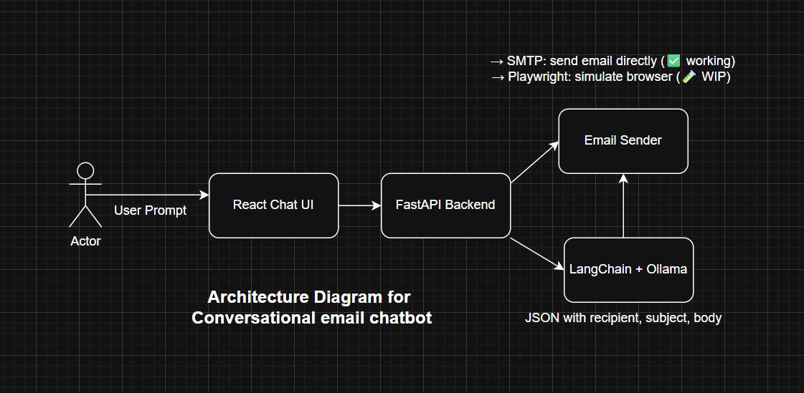

# 💬 Conversational Email Assistant using LLMs, FastAPI, and Gmail Automation

This project is a voice-activated chatbot that takes your natural language prompt (like "Send a mail to HR requesting internship") and intelligently **generates and sends an email** using AI. The system is built with **LangChain + Ollama for LLM**, **FastAPI for backend**, and two approaches for sending emails:

1. ✅ Final Working: **SMTP (Gmail App Password)** – Background, reliable delivery.
2. 🧪 Attempted First: **Playwright (Browser Automation)** – Visual but unstable.

---

## 📘 My Journey Building This Project

When I started building this chatbot, I wanted it to **simulate a real user**: opening Gmail, clicking compose, filling in the fields, and hitting send — **just like a human**.

### 🔹 Attempt 1: Playwright Automation

- Started by using **Playwright** to automate Gmail login.
- Created persistent session using Chrome and generated `auth.json`.
- ✅ Browser opened → Gmail loaded → Compose clicked
- ❌ BUT: Got stuck at filling the subject line — no prompt or cursor response.

> 🧠 I spent hours debugging selector mismatches, adding waits, screenshots, retries... but it wouldn't consistently work across runs.

### 🔁 The Pivot: Switching to SMTP

I realized Gmail browser DOM is too dynamic and flaky for full automation, so I **shifted my focus to SMTP** using Python’s `smtplib`.

- Enabled **2FA in Gmail**
- Generated a **16-character App Password**
- Added it securely in a `.env` file
- Wrote a clean backend that sends email directly in the background
- ✅ This worked **100% reliably!**

Now, I can give a voice command like:

> “Send a follow-up email to john@gmail.com thanking him for the interview.”

And the system generates:
- `To: john@gmail.com`
- `Subject: Thank you for the interview`
- `Body: Hi John, thank you for taking the time... Regards, Mounika Reddy Boggari`

And instantly sends it via Gmail using SMTP.

---

## 🧱 Project Structure
<pre><code>

emailSender/
├── backend/
│   ├── main.py               # FastAPI entrypoint
│   ├── email_generator.py    # LangChain LLM prompt & parsing logic
│   ├── browser_automation.py # (Old) Playwright Gmail automation
│   ├── email_sender.py       # (New) SMTP Gmail sender
│   ├── .env                  # Store credentials (not tracked)
│   └── requirements.txt
└── frontend/
    └── src/components/
        └── Chat.jsx          # React UI with voice input support

</code></pre>


⚙️ Tech Stack
| Component     | Technology          | Why I Used It                        |
| ------------- | ------------------- | ------------------------------------ |
| LLM Engine    | LangChain + Ollama  | Lightweight, local LLM (llama3.2:1b) |
| Backend API   | FastAPI             | Fast async request handling          |
| Email Send    | SMTP (`smtplib`)    | Stable, secure email delivery        |
| UI Automation | Playwright          | (Attempted) Visual flow, screenshots |
| Frontend      | React.js + Tailwind | Interactive and modern UI            |
| Voice Input   | Web Speech API      | Chrome voice recognition             |
| Secrets Mgmt  | dotenv              | Secure env variable handling         |

📷 Architecture


🧪 Playwright vs SMTP: Comparison

| Feature               | Playwright                    | SMTP                    |
| --------------------- | ----------------------------- | ----------------------- |
| Email sent visually   | ✅                             | ❌                       |
| Screenshot proof      | ✅                             | Mock screenshot         |
| Requires Chrome login | ✅ (manual login once)         | ❌                       |
| App password required | ✅                             | ✅                       |
| Consistency           | ❌ Random bugs                 | ✅ Always works          |
| Status                | ⚠️ Unreliable (subject stuck) | ✅ Used in final version |

🔐 .env Configuration

Create a .env file in backend/:

```
GMAIL_ADDRESS=your_email@gmail.com
GMAIL_APP_PASSWORD=your_16_char_app_password


▶️ How to Run This Project

1. Clone the Repo

git clone https://github.com/MounikaReddy666/emailSender.git
cd emailSender
2. Backend Setup

cd backend
python -m venv env
source env/bin/activate     # Or env\Scripts\activate on Windows
pip install -r requirements.txt
playwright install          # Only if you want to use browser automation
uvicorn main:app --reload

3. Frontend Setup

cd ../frontend
npm install
npm run dev                 # or npm start
4. Test the App
Open http://localhost:3000
```

Speak or type a prompt:

Send an update email to teamlead@gmail.com saying task is complete.
You’ll get either:

✅ Confirmation of email sent.

🖼️ Screenshot (if using Playwright).

❌ Error logs (if config fails).

###💡 **Example Prompts to Try**.

- Send an invitation email to xyz@gmail.com for the hackathon on Saturday.
- Send a thank you note to professor for writing my LOR.
- Send an internship request to hr@company.com with my Java & ML skills.

🧠 Challenges I Faced

| Problem                           | How I Solved It                                      |
| --------------------------------- | ---------------------------------------------------- |
| Gmail automation blocked login    | Used persistent Chrome session with Playwright       |
| Compose box stuck on subject line | Switched to SMTP-based approach after debugging      |
| LLM giving invalid JSON responses | Added strict parsing + recovery for malformed output |
| Voice input browser support       | Used WebkitSpeechRecognition + graceful fallbacks    |

### 🔮 Future Plans

- ✅ Use SMTP for now; retry Playwright later with better DOM handlers  
- 📎 Add support for attachments and improve the UI/UX  
- 🧾 Add **email preview** feature before sending  
- 📊 Create a **dashboard** to view sent mails with timestamps  

---

### ✨ Demo (Screenshots)

  


---

### 👩‍💻 Built By

**Mounika Reddy Boggari**  
Final Year B.Tech | Passionate about AI, Web Dev, and Java  
🔗 [LinkedIn](https://www.linkedin.com/in/mounika-reddy-boggari-a5851b296/)  
📬 Email: boggarimounikareddy@gmail.com

---

### 📜 License

**MIT** – Use it, modify it, contribute back 🙌
